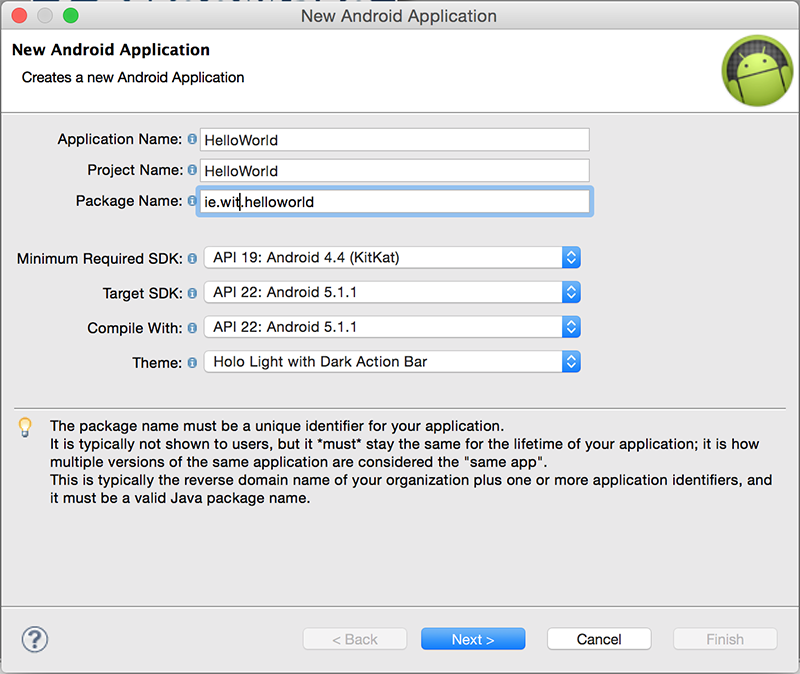
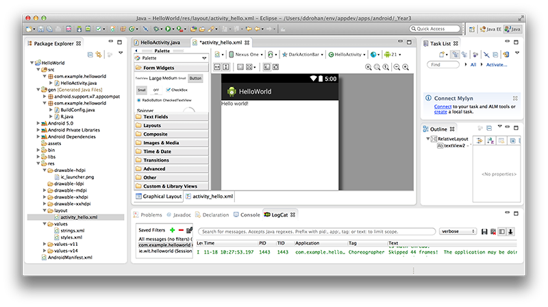

#First Android Project - "HelloWorld"

In Eclipse, select File->New->Other. Navigate to Android, and select "Android Application Project":

Press "Next" and then give the project a name: 'HelloWorld'

It's recommended you change the default package name also, (but you can leave it as it is this time) and accept the rest of the defaults, on the remaining screens. 

You should choose An Empty Activity as your activity type

and name it as in the screenshot below

After you press "Finish", you should now have something similar to the following:

Next, open up the AndroidManifest.xml file in Graphical View, select the 'Application' tab and change the 'Theme' to Theme.Holo.Light with Dark Action Bar, like below

Familiarise yourself with the project layout - the initial xml layout or "screen" is first displayed, this is one of the many resources you will be using and creating throughout this module. We will experiment later with modifying this layout, but first you should run the application.

Select the Project (HelloWorld)->Right-Mouse-Button->Run As->Android Application, as follows:

If you haven't done so already, you will be asked to select/create an AVD (Android Virtual Device), as follows:

and

Use the settings as above and your first Android App should launch like so, (Once you've unlocked the device!):

