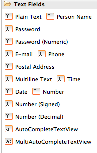
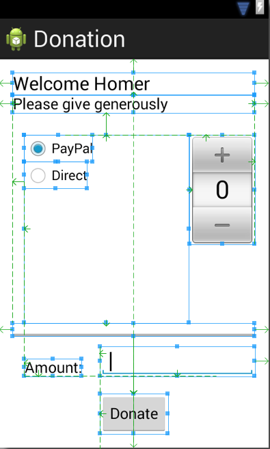
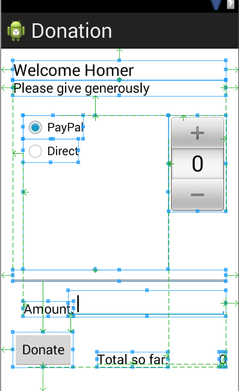

#Exercises

Archive of lab so far:

- [Donation.1.0.zip](../archives/Donation.1.0.zip)

##Exercises 1:

Consider an alternative to the NumberPicker - specifically one of the "Text Fields" controls:

These are mostly EditView objects:

- <http://developer.android.com/reference/android/widget/EditText.html>

Redesign the activity to take a value from the picker or directly from a text view:

If the number picker is set to zero, then attempt to get a number from the text view.

Here is a hint (a version of donatButonPressed that does what we want):

~~~java
  public void donateButtonPressed (View view) 
  {
    String method = paymentMethod.getCheckedRadioButtonId() == R.id.PayPal ? "PayPal" : "Direct";
    progressBar.setProgress(totalDonated);

    int donatedAmount =  amountPicker.getValue();
    if (donatedAmount == 0)
    {
      String text = amountText.getText().toString();
      if (!text.equals(""))
        donatedAmount = Integer.parseInt(text);
    }
    totalDonated  = totalDonated + donatedAmount;
    Log.v("Donate", amountPicker.getValue() + " donated by " +  method + "\nCurrent total " + totalDonated);
   }
~~~

##Exercise 2:

Revise the app such that when the target is achieved (10000) - then no more donations accepted, and the user is made aware of this.

Hint - here is how you can display a simple alert:

~~~java
      Toast toast = Toast.makeText(this, "Target Exceeded!", Toast.LENGTH_SHORT);
      toast.show();
~~~

##Exercise 3:

Show on screen at all times the total amount donated.

You will use standard TextView for this:

- <http://developer.android.com/reference/android/widget/TextView.html>

You already have a number of these on screen. Your layout could be revised to look like this:

Archive of lab with Exercises:

- [Donation.1.5.zip](../archives/Donation.1.5.zip)

