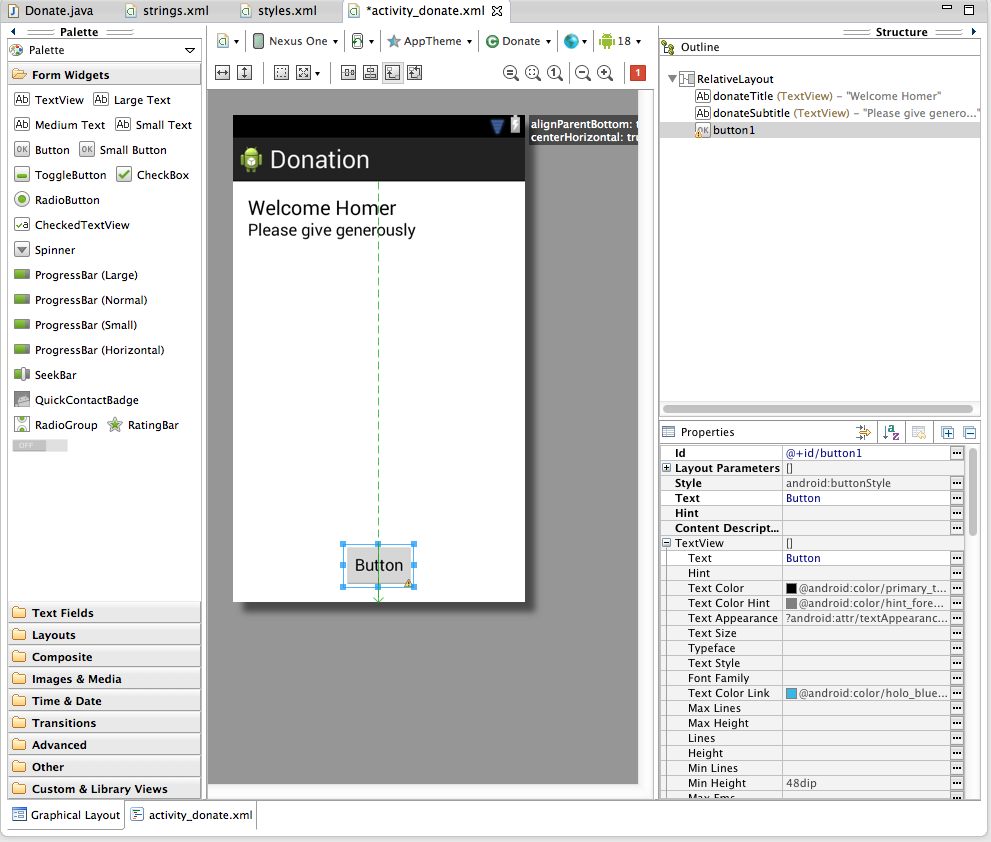
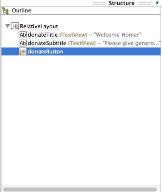
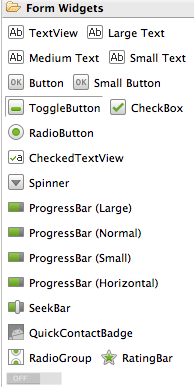
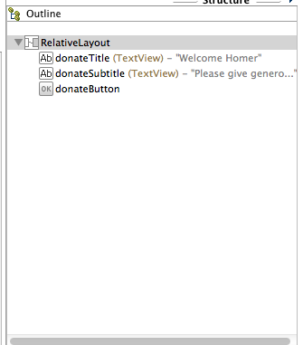
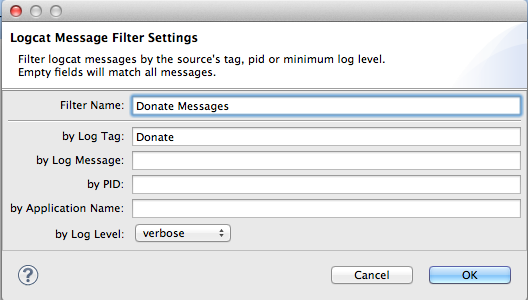
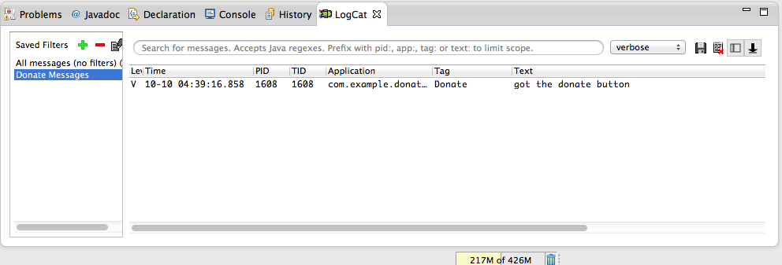

#Step 03 - Donate Button

Place a button directly on to the activity - attached to the bottom of the screen as shown:

Rename the button in the Outline view:

Fix the lint error - and give the button the text 'Donate!'. If all goes as expected, your xml files should be like this:

###activity_donate.xml 

~~~xml
<RelativeLayout xmlns:android="http://schemas.android.com/apk/res/android"
    xmlns:tools="http://schemas.android.com/tools"
    android:layout_width="match_parent"
    android:layout_height="match_parent"
    android:paddingBottom="@dimen/activity_vertical_margin"
    android:paddingLeft="@dimen/activity_horizontal_margin"
    android:paddingRight="@dimen/activity_horizontal_margin"
    android:paddingTop="@dimen/activity_vertical_margin"
    tools:context=".Donate" >

    <TextView
        android:id="@+id/donateTitle"
        android:layout_width="wrap_content"
        android:layout_height="wrap_content"
        android:layout_alignParentLeft="true"
        android:layout_alignParentRight="true"
        android:layout_alignParentTop="true"
        android:text="@string/donateTitle"
        android:textAppearance="?android:attr/textAppearanceLarge" />

    <TextView
        android:id="@+id/donateSubtitle"
        android:layout_width="wrap_content"
        android:layout_height="wrap_content"
        android:layout_alignParentLeft="true"
        android:layout_alignParentRight="true"
        android:layout_below="@+id/donateTitle"
        android:text="@string/donateSubtitle"
        android:textAppearance="?android:attr/textAppearanceMedium" />

    <Button
        android:id="@+id/donateButton"
        android:layout_width="wrap_content"
        android:layout_height="wrap_content"
        android:layout_alignParentBottom="true"
        android:layout_centerHorizontal="true"
        android:text="@string/donateButton" />

</RelativeLayout>
~~~

##strings.xml

~~~xml
<?xml version="1.0" encoding="utf-8"?>
<resources>

    <string name="app_name">Donation</string>
    <string name="action_settings">Settings</string>
    <string name="donateTitle">Welcome Homer</string>
    <string name="donateSubtitle">Please give generously</string>
    <string name="donateButton">Donate</string>

</resources>
~~~

If there is a deviation from the above - retrace your steps (delete the button) until you can match the above.

We can now switch our attention to the Java Activity class Donate:

~~~java
package com.example.donation;

import android.os.Bundle;
import android.app.Activity;
import android.view.Menu;

public class Donate extends Activity
{

  @Override
  protected void onCreate(Bundle savedInstanceState)
  {
    super.onCreate(savedInstanceState);
    setContentView(R.layout.activity_donate);
  }

  @Override
  public boolean onCreateOptionsMenu(Menu menu)
  {
    // Inflate the menu; this adds items to the action bar if it is present.
    getMenuInflater().inflate(R.menu.donate, menu);
    return true;
  }
}
~~~

For any 'controls' a user can interact with we usually find it useful to associate a class member with that object. Currently we only have one - a Button. The text fields we dont consider 'interactive' as such, so we will not include those.

Insert the following new field into the class:

~~~java
  private Button donateButton;
~~~

The class will have to be imported. The class name will always match the name in the Pallette:

We are free to call the variable anything we like. However, in order to keep confusion to a minimum, always call the variable by the same name you used in the Outline view:

In onCreate - we need to initialise this variable:

~~~java
    donateButton = (Button) findViewById(R.id.donateButton);
~~~

We might also add a logging message so we can have some feedback as the app launches:

~~~
    Log.v("Donate", "got the donate button");
~~~

This is the complete activity class:

~~~java
package com.example.donation;

import android.os.Bundle;
import android.app.Activity;
import android.util.Log;
import android.view.Menu;
import android.widget.Button;

public class Donate extends Activity
{
  private Button donateButton;
  
  @Override
  protected void onCreate(Bundle savedInstanceState)
  {
    super.onCreate(savedInstanceState);
    setContentView(R.layout.activity_donate);
    
    donateButton = (Button) findViewById(R.id.donateButton);
    Log.v("Donate", "got the donate button");
  }

  @Override
  public boolean onCreateOptionsMenu(Menu menu)
  {
    getMenuInflater().inflate(R.menu.donate, menu);
    return true;
  }
}
~~~

Finding the log message can be very difficult, unless you set a filter. In the 'LogCat' view in eclipse, create a filter like this:

If you then select the filter, we should see our message:

We should check the donate button actually exists before logging our success:

~~~java
    if (donateButton != null)
    {
      Log.v("Donate", "Really got the donate button");
    }
~~~

Run the app again, and verify the above message appears.

