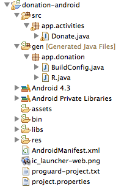

#Package Name

This is the current version of the donation-android app:

- [Donation.1.5.zip](../archives/Donation.1.5.zip)

This version is a little misconfigured - we have a leftover package name 'com.example.donation' from the project generation wizard. This can be changed by editing the AndridManifext.xml file:

~~~xml
<manifest xmlns:android="http://schemas.android.com/apk/res/android"
    package="app.donation"
    android:versionCode="1"
    android:versionName="1.0" >
~~~

Once you save this - it would regenerate the correct 'gen' files. Delete the old one as we no longer need it (com.example.donation)

We should also take this opportunity to change the name of the 'donation' package to 'app.activities'. Android does not like packages with a single 'segment'.

