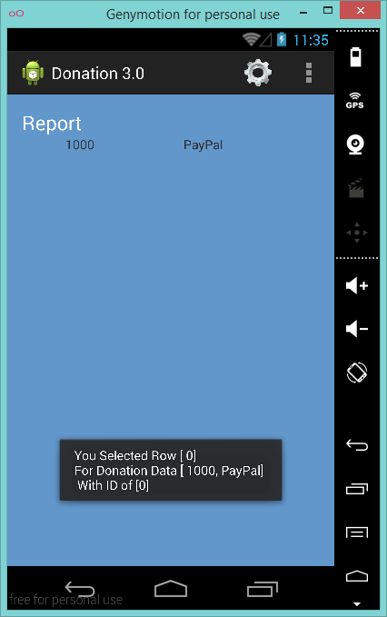

#Exercise & Solution

As a final exercise, try and add some event handling to the Report Activity - i.e. when the user selects a row in Report List, display a simple toast detailing which row was selected and the donation data from that row.

Something like this:

Project Solution:

- [Donation.3.0](../archives/Donation.3.0.zip)

