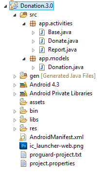

#Donation Model & Base Class

In order to keep our application design coherent, we now bring in an Base class and a Donation class to manage our Donations. You can continue with your own version of the app or start with the solution from the previous lab - [Donation.2.0](../archives/Donation.2.0.zip)

First, create a new package called 'app.models' and bring in this class here:

~~~java
package app.models;

public class Donation
{
  public int    amount;
  public String method;
  
  public Donation (int amount, String method)
  {
    this.amount = amount;
    this.method = method;
  }
}
~~~ 

Next, Create a new class called 'Base' and add it to the 'app.activities' package:

~~~java
public class Base extends Activity
{
  public final int       target       = 10000;
  public int             totalDonated = 0;
  public static List <Donation> donations    = new ArrayList<Donation>();
  
  public boolean newDonation(Donation donation)
  {
    boolean targetAchieved = totalDonated > target;
    if (!targetAchieved)
    {
      donations.add(donation);
      totalDonated += donation.amount;
    }
    else
    {
      Toast toast = Toast.makeText(this, "Target Exceeded!", Toast.LENGTH_SHORT);
      toast.show();
    }
    return targetAchieved;
  }
  
  @Override
  public boolean onCreateOptionsMenu(Menu menu)
  {
    getMenuInflater().inflate(R.menu.donate, menu);
    return true;
  }
  
  @Override
  public boolean onPrepareOptionsMenu (Menu menu){
      super.onPrepareOptionsMenu(menu);
      MenuItem report = menu.findItem(R.id.menuReport);
      MenuItem donate = menu.findItem(R.id.menuDonate);
      
      if(donations.isEmpty())     
           report.setEnabled(false);
      else
        report.setEnabled(true); 
   
      if(this instanceof Donate){
          donate.setVisible(false);
          if(!donations.isEmpty())     
                report.setVisible(true);
        }
      else {
        report.setVisible(false);
        donate.setVisible(true);
        }
      
      return true;  
  }
  
  public void settings(MenuItem item)
  {
    Toast.makeText(this, "Settings Selected", Toast.LENGTH_SHORT).show();
  }
  
  public void report(MenuItem item)
  {
    startActivity (new Intent(this, Report.class));
  }
  
  public void donate(MenuItem item)
  {
    startActivity (new Intent(this, Donate.class));
  }
}

~~~

Notice our List of Donations in the Base class - we will use this list to display our Donations in the Report.

Your project should now look as follows:

