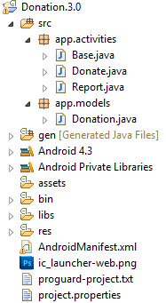

#Setup - Starter Code

As with the previous labs, you can download the solution for [Donation.3.0](../archives/Donation.3.0.zip), or continue on with your own version.

Your current project should looks as follows:

In this lab, you are required to do the following:

- Add a new Menu Option - 'Reset' - to clear out any donations after the target is reached 

- Add Database Support to Donation to manage the donations made

The following steps will guide you through these requirements, so we'll start with Menu Option.

 