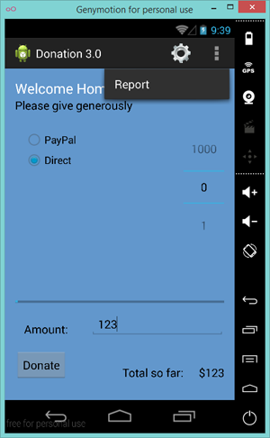
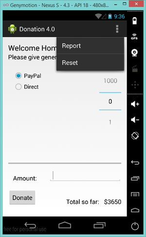

#Adding a new Menu Option

First of all, confirm that the current Menu looks like this:

but we want something like this:

The first thing to do is add in a new resource in strings.xml

~~~xml
 	<string name="menuReset">Reset</string>
~~~

and then the corresponding menu item in donate.xml

~~~xml
 	<item
        android:id="@+id/menuReset"
        android:orderInCategory="100"
        android:showAsAction="never"
        android:title="@string/menuReset"
        android:onClick="reset"/> 
~~~

It's probably worth removing the 'Settings' menu item at this stage too. Next, edit <b>Base.java</b> and add in the following method stub

~~~java
public void reset(MenuItem item) {}
~~~

to ensure our app won't crash when the menu loads (and looks for a method 'reset')

Run the app again and confirm you get the following Menu :

We can't implement this menu option fully yet, so for the moment, we'll just 'reset' the target amount back to zero (0) - Step 03.

