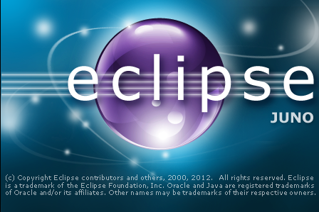
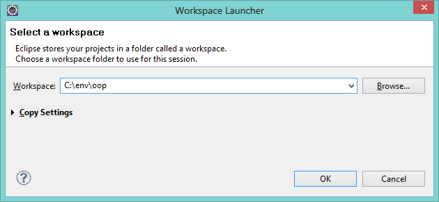
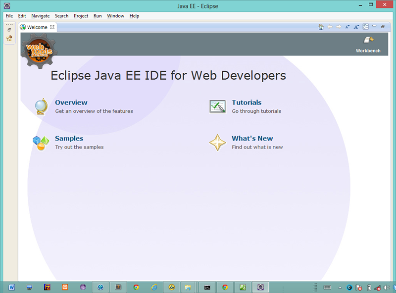
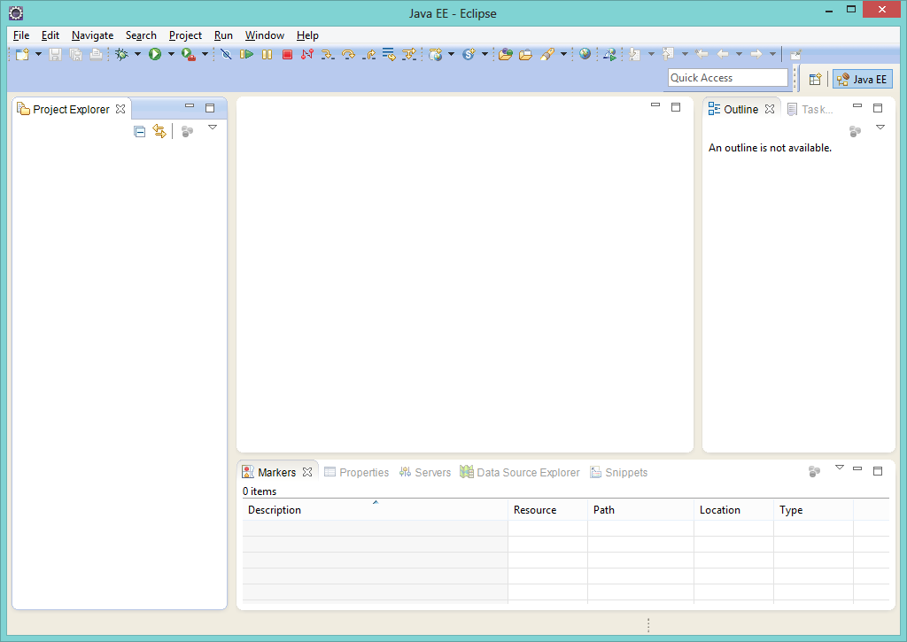

# Step 01

#Setup

##Instructions for working in Walton Building PC Labs:

If you are working on the workstations in the IT Building, locate the C: Drive in the Explorer, and navigate to 'C:\dev\javaee\eclipse' folder. Run (double click on) the "Eclipse" application.

Proceed with the next step of the lab.

##Instructions for working on your own laptop

Download and install the Eclipse IDE from

 - <http://www.eclipse.org>

Select the version "Eclipse for Java EE Developers". The primary prerequisite for installing Eclipse is that you have a recent Java installation on your workstation. To see if you have Java, and to install it if you do not, visit:

 - <http://www.java.com>

Installing Eclipse is usually just a matter of unarchiving the Eclipse download. This unarchiving tool here will generally be much faster than native windows archive support:

 - <http://www.7zip.com>

Next, navigate to and explore the new "eclipse" folder

You will notice the program "eclipse" in there - double click to launch it now. It should launch in about 30 seconds. At first you will see this splash screen:

 
And then it will eventually display this dialog box:

Before pressing "OK", read the suggested path carefully. This is the path where eclipse will create and manage any projects you create The suggested path may be ok for the moment - but ideally the best location is directly from your C: drive, perhaps in a subdirectory called 'env\oop' as shown, but this can be changed later. 

When naming files/folders a useful practice is to keep with the following rules:

- always use lower case
- never use spaces. To break up a name, use hyphens (-) instead
- on windows, manage directories from the root of C:

Press OK. After a few seconds, Eclipse should launch looking like this:

If you close the welcome screen - then you should see the default project layout:

If you can see this screen, congratulations - you have installed and launched the Eclipse Development Environment.

